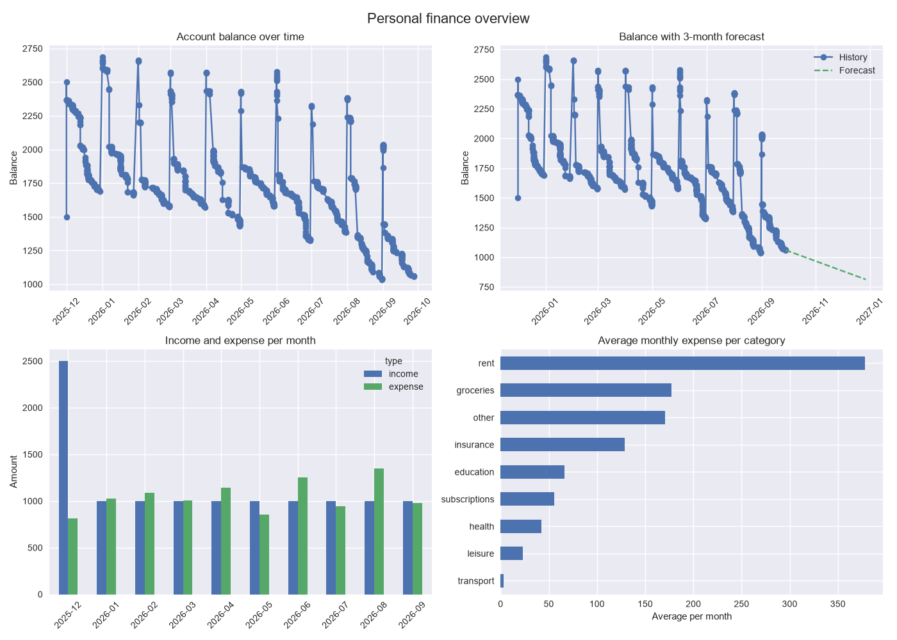

# Personal Finance Assistant

A simple command-line tool that tracks your income and expenses, detects
recurring payments (like rent or subscriptions), predicts your future
account balance, draws an overview chart, and gives basic text recommendations for saving money.

This project was built as the final project for the "Introduction to
Python" course at TU Dortmund.

## Features

- Add, edit, delete, and list transactions (income or expense)
- Import transactions from a CSV file (a realistic example file is included)
- Check your current balance
- Detect recurring payments (e.g. monthly rent)
- Predict your balance a few months into the future
- Get simple, rule-based recommendations for saving, spending and investing
- Save an overview image with four charts
- Configure your own income/expense categories and thresholds
- Automatic backup of your data, with restore if the data file gets damaged

## Requirements

- Python 3.10 or newer
- [uv](https://docs.astral.sh/uv/) (used to install and run the project)

The dependencies (pandas, matplotlib, numpy) are installed automatically.

## Installation

Clone the repository and install it in editable mode:

```bash
git clone https://github.com/sed-mirzaee/Personal-Finance-Assistant.git
cd Personal-Finance-Assistant
uv pip install -e .
```

## Running the program

```bash
uv run -m personal_finance_assistant
```

You will see a welcome message and a short menu. Type `help`
at any time to see the full list of commands.

## Quick start with the example data

The file `examples/sample_transactions.csv` contains about ten months of
realistic, anonymised transactions (an opening balance, a monthly income,
rent, insurance, groceries and more). To try every feature at once:

```text
pfa> import
  path to CSV file: examples/sample_transactions.csv
pfa> balance
pfa> recurring
pfa> predict
pfa> chart
```

## Available commands

| Command     | What it does                                                   |
|-------------|----------------------------------------------------------------|
| `add`       | Add a new transaction (income or expense)                      |
| `list`      | Show all transactions                                          |
| `edit`      | Edit an existing transaction                                   |
| `delete`    | Delete a transaction by its id                                 |
| `import`    | Import transactions from a CSV file                            |
| `balance`   | Show your current balance                                      |
| `recurring` | Detect recurring (roughly monthly) payments                    |
| `predict`   | Predict your balance a number of months ahead                  |
| `recommend` | Get text recommendations based on your finances                |
| `chart`     | Save an overview image with four charts as a PNG file          |
| `settings`  | View or change categories and thresholds                       |
| `help`      | Show the full list of commands                                 |
| `exit`      | Quit the program                                               |

`recurring`, `predict`, `recommend` and `chart` need at least one
transaction. If there are none yet, the program tells you to add or import
some first.


## CSV format for import

The CSV file needs a header row with these columns:

```text
date,type,amount,category,note
2026-01-01,income,1000.0,salary,monthly income
2026-01-03,expense,420.0,rent,monthly rent
```

- `date` in the format `YYYY-MM-DD`
- `type` is `income` or `expense`
- `amount` is a positive number (the type decides whether it is added or subtracted)
- `category` should be one of your categories (see `settings`); other names are imported as they are
- `note` is optional

Rows with errors are skipped and reported; all other rows are imported.

## The overview chart

The `chart` command saves one image to `~/.personal_finance_assistant/finance_overview.png`, with four charts:

| Top left                  | Top right                              |
|---------------------------|----------------------------------------|
| Balance over time         | Balance with forecast (dashed line)    |
| **Bottom left**           | **Bottom right**                       |
| Income and expense per month | Average monthly expense per category |

The number of forecast months is set by the `forecast_months` setting.

Example output with `examples/sample_transactions.csv`:


## How the forecast works

There are two forecast methods, chosen with the `forecast_method` setting:

- **`trend`** (default): a straight line (linear regression) is fitted through
  your daily balance. Its slope shows how much the balance changes per day on
  average. The forecast starts from your current balance and continues with
  that slope. This includes all spending, also irregular costs like groceries.
- **`recurring`**: starts from your current balance and assumes that every
  recurring payment (for example salary, rent or insurance) keeps happening
  every month with its average amount. Irregular spending is not included,
  so this method is usually too optimistic.

With the example data, `trend` predicts a small monthly decrease, which is
close to what really happened, while `recurring` predicts a large increase.

## Settings

Use the `settings` command to change these values:

| Setting                       | Default | Meaning                                                |
|-------------------------------|---------|--------------------------------------------------------|
| `income_categories`           | list    | Allowed income categories                              |
| `expense_categories`          | list    | Allowed expense categories                             |
| `monthly_expense_limit`       | `0.0`   | Warn when expenses exceed this (0 = no limit)          |
| `report_months`               | `3`     | Default number of months in reports                    |
| `recurring_min_interval_days` | `25`    | Shortest gap still counted as "monthly"                |
| `recurring_max_interval_days` | `35`    | Longest gap still counted as "monthly"                 |
| `recurring_amount_tolerance`  | `0.15`  | Allowed amount variation (0.15 = 15%)                  |
| `low_savings_rate`            | `0.10`  | Below this share of income, suggest saving more        |
| `high_spending_share`         | `0.30`  | Above this share of income, flag the category          |
| `forecast_months`             | `3`     | Months ahead shown in the forecast chart               |
| `forecast_method`             | `trend` | `trend` (linear regression) or `recurring`             |
| `emergency_fund_months`       | `3`     | Months of expenses to keep before suggesting to invest |

The category `other` is required and cannot be removed.

## Where your data is stored

All files are kept in your home folder, under `.personal_finance_assistant/`.
They are created automatically, so there is nothing to set up manually.

| File                     | Content                                               |
|--------------------------|-------------------------------------------------------|
| `account.json`           | Your transactions                                     |
| `account.json.bak`       | Backup of the previous version of `account.json`      |
| `settings.json`          | Your settings                                         |
| `finance_overview.png`   | The image created by the `chart` command              |

### If the account file gets damaged

Before every save, the program copies the current `account.json` to
`account.json.bak`, and it writes the new file in one step, so the file is
never left half-written.

If `account.json` still cannot be read (for example after editing it by
hand), the program does not crash. It shows what is wrong and asks what
to do:

- `restore` goes back to the last backup
- `reset` starts a new, empty account. The damaged file is kept and renamed
  (for example `account.damaged-20260929-193000.json`), never deleted.
- anything else leaves the file as it is, so you can fix it yourself


## Running the tests and the code check

```bash
uv run pytest -v
uv run ruff check src tests
```

The tests never touch your real data files; they use temporary folders.

## Project structure

```text
Personal-Finance-Assistant/
├── src/
│   └── personal_finance_assistant/
│       ├── __init__.py      # public functions and version
│       ├── __main__.py      # allows "python -m personal_finance_assistant"
│       ├── cli.py           # the interactive command-line menu
│       ├── data_model.py    # the Transaction data structure and validation
│       ├── account.py       # loading, saving, backup and import of transactions
│       ├── settings.py      # user settings (categories, thresholds)
│       ├── analysis.py      # recurring payments, forecast, recommendations
│       └── charts.py        # the overview image (matplotlib)
├── examples/
│   ├── sample_transactions.csv   # example input data
│   └── finance_overview.png      # chart created from the example data
├── notebooks/
│   └── demo.ipynb           # sample commands and outputs
├── tests/                   # pytest tests
├── pyproject.toml
└── README.md
```

## License

MIT

## Author

Sedigheh Mirzaei — TU Dortmund, Introduction to Python course project.
